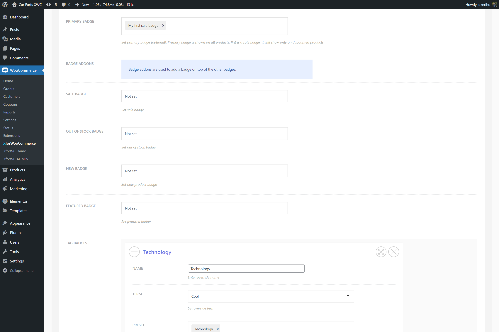

# Badge manager

`Badge Manager` tab under the plugin settings page is used to assign the badge presets. Badge presets cannot appear anywhere unless they are assigned using the manager.

The first option in the manager is the `Primary Badge`. This primary badge is shown on all products. If this is set to be a sale badge, then it'll be shown only on products that are on sale. Primary badge is very useful if you want replace your theme sale badges, but is considered optional and you don't have to use it if you just want to addon some new badges to your existing ones from the theme you use.

The other example of using the `Primary Badge` would be to make a label with text **Available** and then use the overrides to make an **Unavailable** badge as well, but this is all subject to your shop needs and likings.

product-badges--badge-manager-add-badges-woo.png)

## Badge addons and overrides

The manager is split into two sections, `Badge Addons` and `Badge Overrides`. They have the same settings for sale, out of stock, new, featured, tags and categories.

The difference is how these modules add badges. Overrides will as name suggest replace the badges in whole, while the addon options will add badges on top.

## Badge addons

`Badge Addons` are used to add new badges on top of existing ones. For example, if we have a sale badge set as a primary badge and we need to add on top of this badge a **Featured** badge, then we'd use the badge addons.

To do just that, set the badge preset under the `Featured Badge` that will represent the featured products. Usually this will be a text badge with the featured label or a custom image badge. Once set and the options are saved, on shop or product page, for products that are on sale and featured, just under the sale badge a newly assigned feautured badge will appear.

Badge addons are useful to add badges for certain tags and categories as well. The options for tags and categories are avialable.

## Badge overrides

`Badge Overrides` are used to replace all current badges. For example, we have a primary badge set as a sale badge. Now, sometimes we don't want to show the sale badge on products that are out of stock. When under the overrides section we assign the `Out of Stock Badge` badge, it'll do just that. When a product is out of stock, it'll skip the badge that is set as a primary one and only the newly assigned out of stock badge will appear.

Badge overrides have options for tags, categories, as well as the new, featured, out of stock and sale badges.
