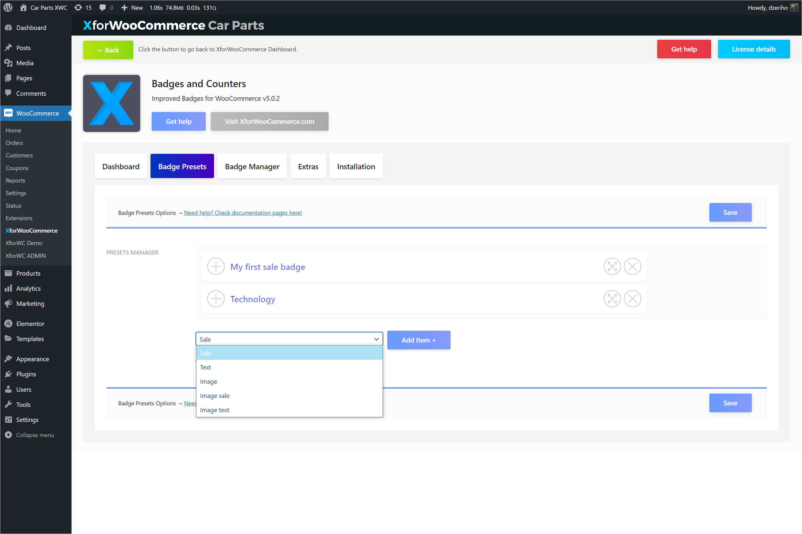

# Badge types

Badges are split into types.

### Sale

Sale badges are shown and used on products that are on sale. Products are on sale if their Woo option `Sale Price` is set to lower than `Regular Price`. Products on sale can have scheduled sales activated. Scheduled sales are also Woo options. You can access these options by editing a product under the `General` tab in the `Product Data` card.

These badges show information about the product sales, such as percentage of sale, money saved etc.

### Text

Text badges are used for labeling. Here you show a set text within the badge. This can be useful in many ways.

### Image

Image badge is an image used as a badge on a product. When creating one add an image and set it's width.

:::tip
Use PNG images for transparent effects. Use small image sizes. Match the image width or make it 2x for the retina displays.
:::

### Image sale

Image sale badge uses an image as a background. Further badge will process and show product sale and scheduled sale information accordingly. These `Image sale` badges are also considered as sale badges, so they will only show on products that are on sale.

### Image text

Image text is similar to plain text badges, but uses an image as a background. Options for image, image width and to enter the label text that will appear on top of the background are avaialble.

