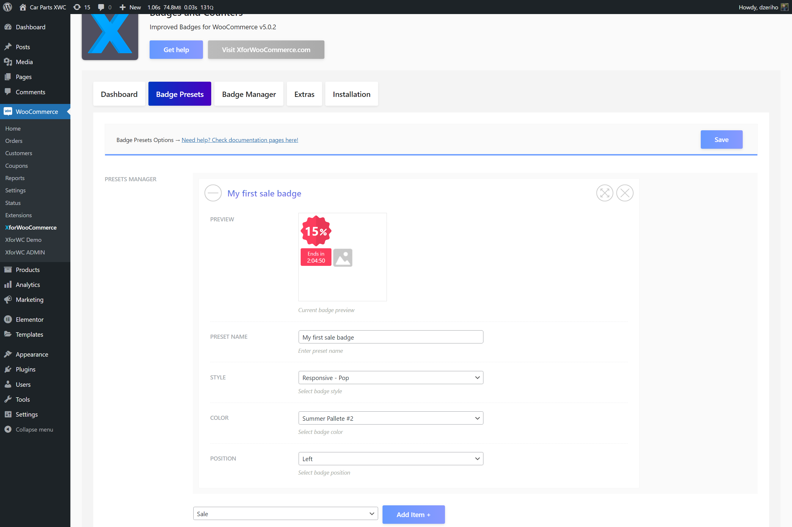
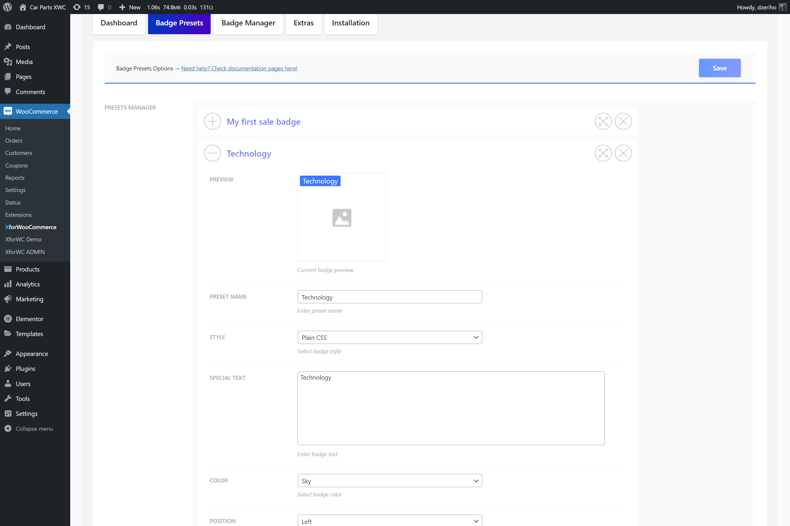

# Create your first badge

To start and create your first badge in the plugin settings page choose tab `Badge Presets`.

The dropdown aside the `Add Item +` button declares the badge type. The button itself creates a new badge card based on the selected type. Options are not saved until the `Save` button is clicked.

## First steps after integration

If you're using the `Woo Template` integration option, the plugin will completly replace current theme badges, so you'd first need to create a primary `Sale` badge.

1. In the dropdown select `Sale` and click the `Add Item +`
2. Once the new badge card is created name it. Fill in the `Preset Name`
3. A sale badge has `Style`, `Color` and `Position` options. Set this options to your likings
4. Setting the badge name and options creates a new badge, still this badge isn't assigned anywhere
5. To do that visit the `Badge Manager` tab
6. In the manager under `Primary Badge` set the newly created sale badge by selecting it from the dropdown by name. The primary badge is shown on all products. Since sale badges are shown only on products on sale the primary badge can be used as a default badge when using the `Woo Template` integration
7. Click `Save` button to keep the settings
8. You can check your Shop and Product pages for the new sale badge and see if the integration worked correctly

:::info
Sale badges are only shown on products that are on sale. Products on sale have a sale price defined in the Woo product page.
:::

:::info
Sale timers below the sale badge are shown on products which have scheduled sales activated. These options are from the Woo itself. To set the scheduled sale navigate product page and use the `Schedule` link bellow the `Sale Price` input under `General` product data tab.
:::

## Adding more badges

If you're using the action and hooks integration, or you're just done with the `Woo Template` integration and want to addon some new badges read more to learn how.

1. Navigate the `Badge Presets` tab in the plugin settings page
2. Create a new badge by clicking the `Add Item +` button. Select the type to be `Text`
3. Text badges allow text input and are not used as sale badges, at least not generally
4. Once the new badge card is created name it. Fill in the `Preset Name`
5. A sale badge has `Style`, `Color` and `Position` options. Set this options to your likings
6. Enter text in the `Special Text` textarea. This text will show on the badge
7. For example, let's enter **New**
8. Now navigate the `Badge Manager` tab
9. Here within the `Badge Addons` options, under the `New Badge` select this new badge
10. Remember to click `Save` at the end to keep your settings
11. If everything is set correctly, this new badge will appear on products that are created within the last 7 days

:::tip
Need to alter the new product period? Visit the `Extras` tab under the plugin settings and set the option `New Badge Period`. Enter the number of days that a product is considered new by your shop.
:::

To learn more about the `Badge Manager` read more in this article [Badge Manager](./badge-manager).