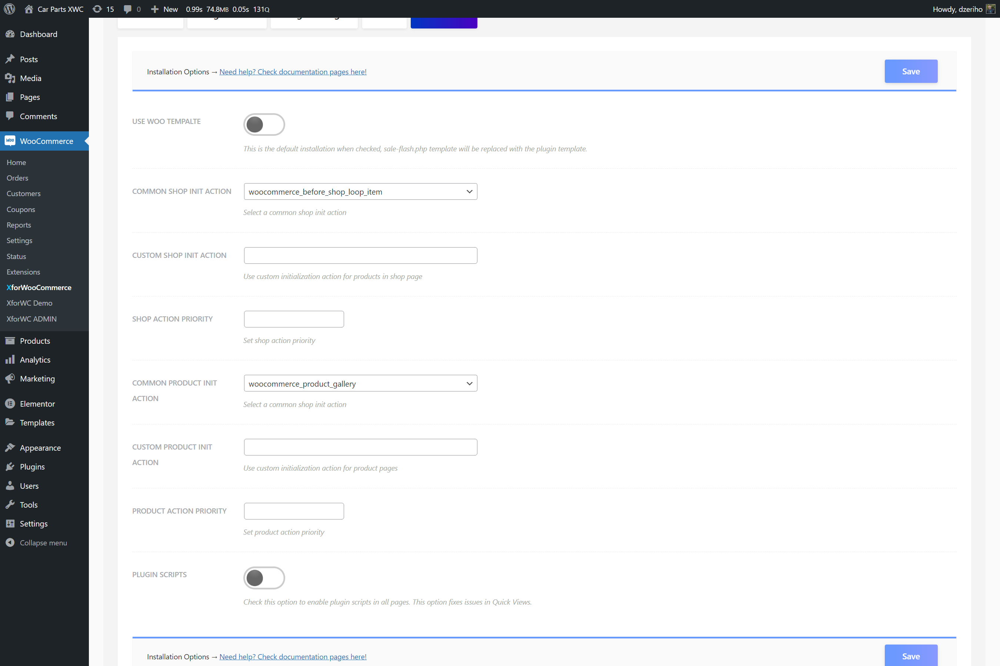

# Actions and hooks

To integrate the Product Badges plugin using the actions and hooks integration option, navigate the plugin settings page.

1. If you use XforWooCommerce navigate `WooCommerce > XforWooCommerce`, enter the `Product Badges` dashboard. Are you using the stand-alone plugin? Navigate `WooCommerce > Settings > Product Badges` to visit the plugin settings page
2. Once there, click the `Installation` tab
3. The `Use Woo Template` option should be off, as we don't want to replace the template, but just addon new badges
4. From the `Shop Init Action` select box choose a default action/hook. The default action used by almost every theme is `woocommerce_before_shop_loop_item`
5. From the `Product Page Init Action` select box choose a default action/hook. The default action used by almost every theme is `woocommerce_before_single_product_summary`
6. If you'd use your own custom action, use the `Custom Shop Init Action` and `Custom Product Page Init Action` options respectively and enter the action name too hook the plugin template
7. Click the `Save` button to keep your settings

:::tip
Action/hook is a place in code that executes as the website renders. We can integrate a plugin this way by hooking it onto an appropriate action/place in the web page.
:::

These actions and hooks are mostly default and used in all themes, so this isn't something to hard to setup. There are problems, as all themes are different, and those will be explained in the next chapter.

Hooked actions have priorities, so you can use those options to fine tune the integration.

The badges should now be integrated with the actions and hooks option. This option works for both shop and product pages. To see if the things are working correctly, we need to assign some badges and test things out.

To learn how to do this navigate the [Create your first badge](../badges/create-your-first-badge).

