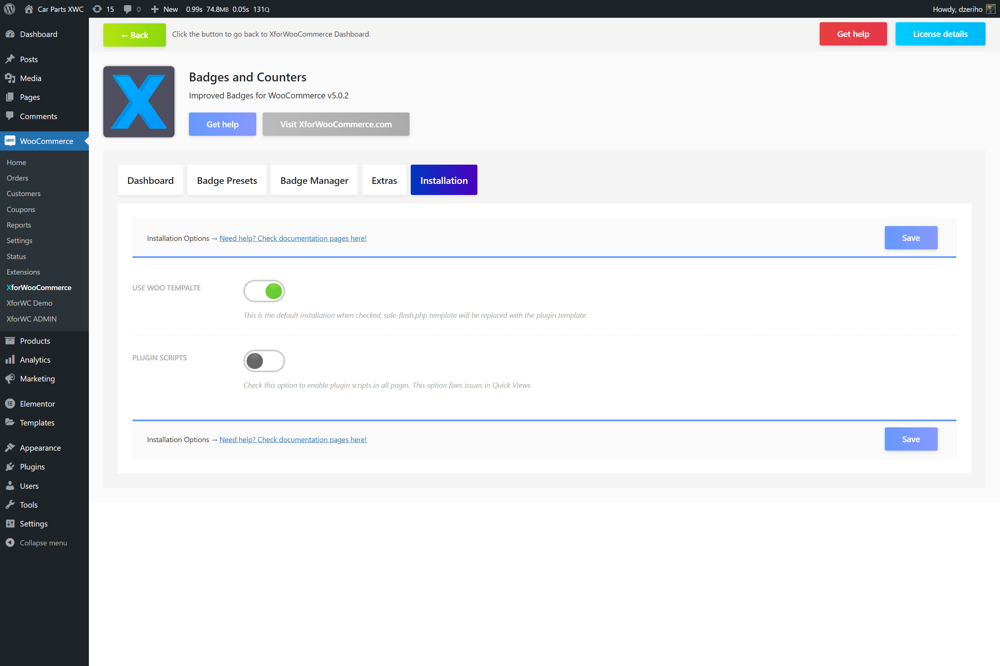

# Replace Woo template

To integrate the Product Badges plugin using `Woo Template` replacement integration option, navigate the plugin settings page.

1. If you use XforWooCommerce navigate `WooCommerce > XforWooCommerce`, enter the `Product Badges` dashboard. Are you using the stand-alone plugin? Navigate `WooCommerce > Settings > Product Badges` to visit the plugin settings page
2. Once there, click the `Installation` tab
3. Activate the `Use Woo Template` option
4. Click the `Save` button

The badges should now be integrated with the template replacement option. This option works for both shop and product pages. To see if the things are working correctly, we need to assign some badges and test things out.

To learn how to do this navigate the [Create your first badge](../badges/create-your-first-badge).

