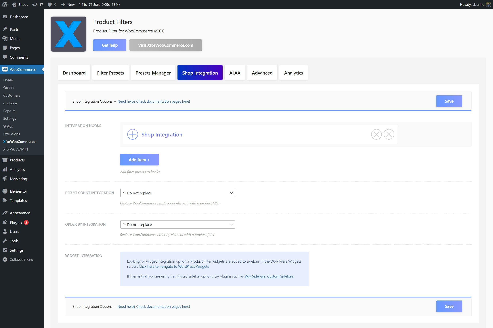
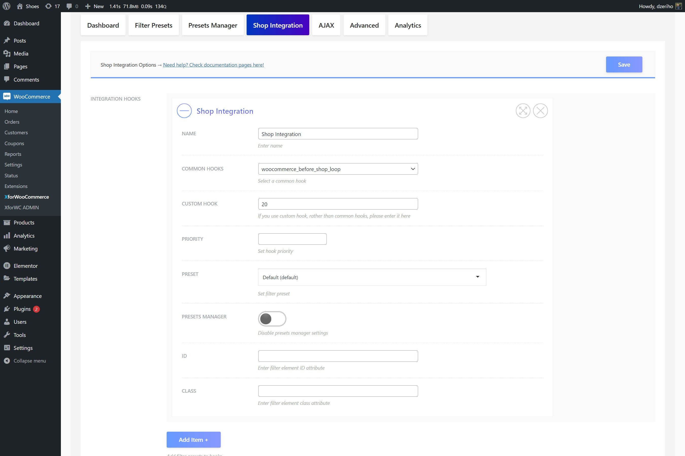

# Actions and hooks

Usual widget sidebar integration doesn't work for you? With the custom hooked display action you can get more complex results. One of the most favorite one is the so called "Filter on Top". This means the filter will be above your products.

This is a lot easier than it sounds as the Product Filter has a manager to help you with this. Navigate the Product Filter settings page and from there the tab `Shop Integration`.

The option `Integration Hooks` is the one we're after. This is a manager that helps you hook a Product Filter onto a common or custom action.

To start, click the `Add Item +` button. Name your integration option, e.g. Shop Integration.

From the select option `Common Hooks` chosse a common hook that works for the theme you use. Basically, these hooks in the select box are common and mandatory by WooCommerce.

You can use any of these hooks to add the Product Filter. The most common one would be `woocommerce_before_shop_loop`, but installing it onto a `woocommerce_archive_description` is also very common.

These actions have priorities. Sometimes more elements are hooked onto an action. Like, on `woocommerce_archive_description` there's a hooked element that'll show the product category description, or in the `woocommerce_before_shop_loop` there might be the order by select box or the results count WooCommerce templates. These are hooked onto a priority like 10, 20, 50 or so. This means that your Product Filter priority will determine when to show the Product Filter element. For instance if you want to show it after the desctiption you might need to add a priority 50 or similar, depending on the theme you use code.

Furthere there are more options here, but we would stick for now on this.

**So, to summarize, a basic installation would look like this:**

One item is added using the `Add Item +` button. Name is for example `Shop Integration`. Under `Common Hooks` option select the `woocommerce_before_shop_loop` and set `Priority` to `20`.

Once the options are saved the filter should appear when this action is triggered, which should happen on the Shop page.

To quickly see if everything is right, visit your Shop page and try out the filter. If it happens to work correctly, then everything is set accordingly and the theme you use with your website is recognized, so the filter adjusted and is installed properly.

If this is not the case and Product Filter doesn't work, please visit the Troubleshooting section.

Product Filter can be configured by visiting the Product Filter Settings page. This page is a power-house that runs your Product Filters. All settings are set over there, so let's now go there.

