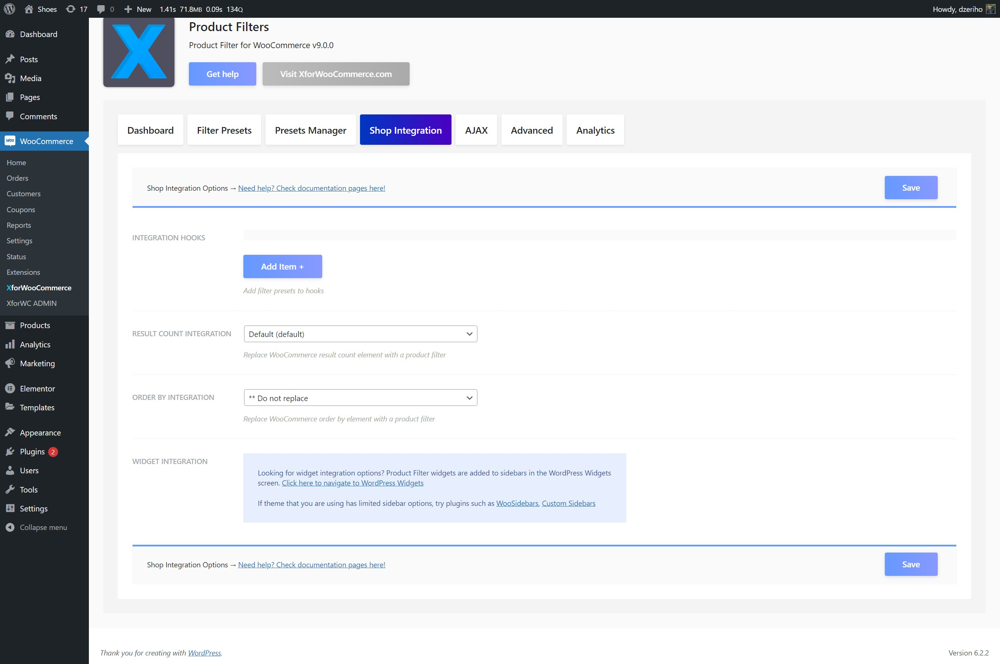

# Template overrides

This is the third option on how you can display the Product Filter in your Shop. This is more a legacy option and you shouldn't really use it, but there's nothing wrong with it.

:::info
Some themes have removed these WooCommerce basic templates from their structure, therefor this section doesn't have any meaning for such themes, so you can skip it.
:::

By default WooCommerce structure, there are two templates that are hooked onto an `woocommerce_before_shop_loop` action. These templates are `orderby.php` and `results-count.php`.

Product Filter has options to control these templates. In the `Shop Integration` tab of the Product Filter settings page you can find options to control these two templates.

Integrating Product Filter using these replaced elements is also an option to integrate the Product Filter.

The control for these elements, allows you to hide them or to replace them with a Product Filter.

Most common use, would be to replace your `Result Count` template with a default Product Filter. Hiding the other one is not neccessery as you can use the order by select box with the Product Filter.

